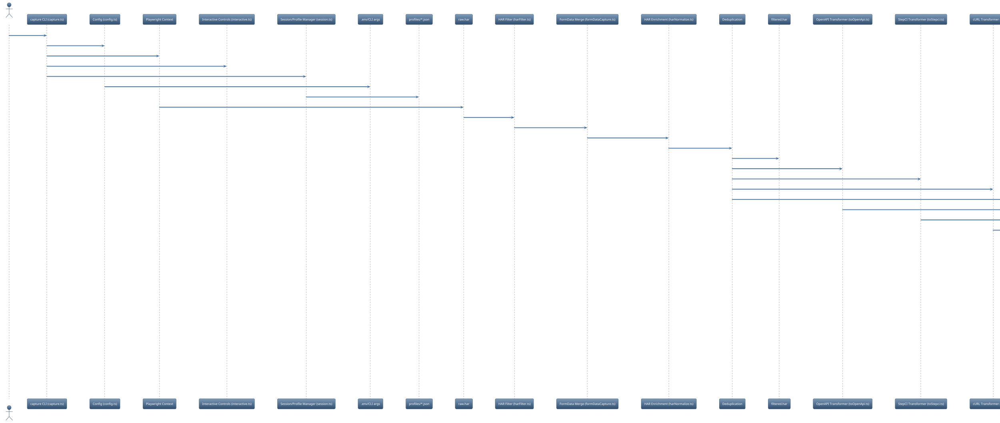

# API Scanner Architecture

---

## 1. PlantUML (copy to plantuml.com/plantuml or VS Code PlantUML extension)



---

## 2. Draw.io (diagrams.net) XML (import via File > Import From > Device)

```xml
<mxfile host="app.diagrams.net"><diagram name="API Scanner HLD" id="api-scanner-hld"><mxGraphModel dx="1000" dy="1000" grid="1" gridSize="10" guides="1" tooltips="1" connect="1" arrows="1" fold="1" page="1" pageScale="1" pageWidth="827" pageHeight="1169" math="0" shadow="0"><root><mxCell id="0"/><mxCell id="1" parent="0"/><mxCell id="2" value="User/CI" style="ellipse;whiteSpace=wrap;html=1;aspect=fixed;" vertex="1" parent="1"><mxGeometry x="40" y="120" width="80" height="40" as="geometry"/></mxCell><mxCell id="3" value="capture CLI (capture.ts)" style="rounded=1;whiteSpace=wrap;html=1;fillColor=#dae8fc;strokeColor=#6c8ebf;" vertex="1" parent="1"><mxGeometry x="180" y="120" width="160" height="40" as="geometry"/></mxCell><mxCell id="4" value="Config (config.ts)" style="rounded=1;whiteSpace=wrap;html=1;fillColor=#e1d5e7;strokeColor=#9673a6;" vertex="1" parent="1"><mxGeometry x="380" y="60" width="120" height="40" as="geometry"/></mxCell><mxCell id="5" value="Playwright Context" style="rounded=1;whiteSpace=wrap;html=1;fillColor=#fff2cc;strokeColor=#d6b656;" vertex="1" parent="1"><mxGeometry x="380" y="120" width="120" height="40" as="geometry"/></mxCell><mxCell id="6" value="Interactive Controls (interactive.ts)" style="rounded=1;whiteSpace=wrap;html=1;fillColor=#f8cecc;strokeColor=#b85450;" vertex="1" parent="1"><mxGeometry x="380" y="180" width="180" height="40" as="geometry"/></mxCell><mxCell id="7" value="Session/Profile Manager (session.ts)" style="rounded=1;whiteSpace=wrap;html=1;fillColor=#d5e8d4;strokeColor=#82b366;" vertex="1" parent="1"><mxGeometry x="380" y="240" width="180" height="40" as="geometry"/></mxCell><mxCell id="8" value=".env/CLI args" style="rounded=1;whiteSpace=wrap;html=1;fillColor=#f5f5f5;strokeColor=#666666;" vertex="1" parent="1"><mxGeometry x="540" y="60" width="100" height="40" as="geometry"/></mxCell><mxCell id="9" value="profiles/*.json" style="rounded=1;whiteSpace=wrap;html=1;fillColor=#f5f5f5;strokeColor=#666666;" vertex="1" parent="1"><mxGeometry x="580" y="240" width="100" height="40" as="geometry"/></mxCell><mxCell id="10" value="raw.har" style="rounded=1;whiteSpace=wrap;html=1;fillColor=#f5f5f5;strokeColor=#666666;" vertex="1" parent="1"><mxGeometry x="540" y="120" width="80" height="40" as="geometry"/></mxCell><mxCell id="11" value="HAR Filter (harFilter.ts)" style="rounded=1;whiteSpace=wrap;html=1;fillColor=#e1d5e7;strokeColor=#9673a6;" vertex="1" parent="1"><mxGeometry x="660" y="120" width="140" height="40" as="geometry"/></mxCell><mxCell id="12" value="FormData Merge (formDataCapture.ts)" style="rounded=1;whiteSpace=wrap;html=1;fillColor=#e1d5e7;strokeColor=#9673a6;" vertex="1" parent="1"><mxGeometry x="820" y="120" width="180" height="40" as="geometry"/></mxCell><mxCell id="13" value="HAR Enrichment (harNormalize.ts)" style="rounded=1;whiteSpace=wrap;html=1;fillColor=#e1d5e7;strokeColor=#9673a6;" vertex="1" parent="1"><mxGeometry x="1020" y="120" width="180" height="40" as="geometry"/></mxCell><mxCell id="14" value="Deduplication" style="rounded=1;whiteSpace=wrap;html=1;fillColor=#f8cecc;strokeColor=#b85450;" vertex="1" parent="1"><mxGeometry x="1220" y="120" width="100" height="40" as="geometry"/></mxCell><mxCell id="15" value="filtered.har" style="rounded=1;whiteSpace=wrap;html=1;fillColor=#f5f5f5;strokeColor=#666666;" vertex="1" parent="1"><mxGeometry x="1340" y="120" width="80" height="40" as="geometry"/></mxCell><mxCell id="16" value="OpenAPI Transformer (toOpenApi.ts)" style="rounded=1;whiteSpace=wrap;html=1;fillColor=#dae8fc;strokeColor=#6c8ebf;" vertex="1" parent="1"><mxGeometry x="1440" y="60" width="180" height="40" as="geometry"/></mxCell><mxCell id="17" value="StepCI Transformer (toStepci.ts)" style="rounded=1;whiteSpace=wrap;html=1;fillColor=#dae8fc;strokeColor=#6c8ebf;" vertex="1" parent="1"><mxGeometry x="1440" y="120" width="180" height="40" as="geometry"/></mxCell><mxCell id="18" value="cURL Transformer (toCurl.ts)" style="rounded=1;whiteSpace=wrap;html=1;fillColor=#dae8fc;strokeColor=#6c8ebf;" vertex="1" parent="1"><mxGeometry x="1440" y="180" width="180" height="40" as="geometry"/></mxCell><mxCell id="19" value="Coverage Builder (coverage.ts)" style="rounded=1;whiteSpace=wrap;html=1;fillColor=#d5e8d4;strokeColor=#82b366;" vertex="1" parent="1"><mxGeometry x="1440" y="240" width="180" height="40" as="geometry"/></mxCell><mxCell id="20" value="openapi.yaml/json" style="rounded=1;whiteSpace=wrap;html=1;fillColor=#f5f5f5;strokeColor=#666666;" vertex="1" parent="1"><mxGeometry x="1640" y="60" width="120" height="40" as="geometry"/></mxCell><mxCell id="21" value="stepci-workflow.yaml" style="rounded=1;whiteSpace=wrap;html=1;fillColor=#f5f5f5;strokeColor=#666666;" vertex="1" parent="1"><mxGeometry x="1640" y="120" width="120" height="40" as="geometry"/></mxCell><mxCell id="22" value="curls/*.sh" style="rounded=1;whiteSpace=wrap;html=1;fillColor=#f5f5f5;strokeColor=#666666;" vertex="1" parent="1"><mxGeometry x="1640" y="180" width="120" height="40" as="geometry"/></mxCell><mxCell id="23" value="coverage.json" style="rounded=1;whiteSpace=wrap;html=1;fillColor=#f5f5f5;strokeColor=#666666;" vertex="1" parent="1"><mxGeometry x="1640" y="240" width="120" height="40" as="geometry"/></mxCell><mxCell id="24" value="Anomaly Detection (anomalies.ts)" style="rounded=1;whiteSpace=wrap;html=1;fillColor=#e1d5e7;strokeColor=#9673a6;" vertex="1" parent="1"><mxGeometry x="1780" y="240" width="180" height="40" as="geometry"/></mxCell><mxCell id="25" value="Drift Detection (drift.ts)" style="rounded=1;whiteSpace=wrap;html=1;fillColor=#e1d5e7;strokeColor=#9673a6;" vertex="1" parent="1"><mxGeometry x="1980" y="240" width="180" height="40" as="geometry"/></mxCell><mxCell id="26" value="anomalies.json" style="rounded=1;whiteSpace=wrap;html=1;fillColor=#f5f5f5;strokeColor=#666666;" vertex="1" parent="1"><mxGeometry x="1780" y="300" width="120" height="40" as="geometry"/></mxCell><mxCell id="27" value="drift.json" style="rounded=1;whiteSpace=wrap;html=1;fillColor=#f5f5f5;strokeColor=#666666;" vertex="1" parent="1"><mxGeometry x="1980" y="300" width="120" height="40" as="geometry"/></mxCell><mxCell id="28" value="HTML Report (htmlReport.ts)" style="rounded=1;whiteSpace=wrap;html=1;fillColor=#fff2cc;strokeColor=#d6b656;" vertex="1" parent="1"><mxGeometry x="2180" y="240" width="180" height="40" as="geometry"/></mxCell><mxCell id="29" value="report.html" style="rounded=1;whiteSpace=wrap;html=1;fillColor=#f5f5f5;strokeColor=#666666;" vertex="1" parent="1"><mxGeometry x="2380" y="240" width="120" height="40" as="geometry"/></mxCell><mxCell id="30" value="Schemathesis" style="rounded=1;whiteSpace=wrap;html=1;fillColor=#d5e8d4;strokeColor=#82b366;" vertex="1" parent="1"><mxGeometry x="1640" y="20" width="120" height="40" as="geometry"/></mxCell><mxCell id="31" value="StepCI" style="rounded=1;whiteSpace=wrap;html=1;fillColor=#d5e8d4;strokeColor=#82b366;" vertex="1" parent="1"><mxGeometry x="1640" y="220" width="120" height="40" as="geometry"/></mxCell><mxCell id="32" value="junit.xml" style="rounded=1;whiteSpace=wrap;html=1;fillColor=#f5f5f5;strokeColor=#666666;" vertex="1" parent="1"><mxGeometry x="1780" y="20" width="120" height="40" as="geometry"/></mxCell><mxCell id="33" value="schema-manifest CLI (schemaManifestCli.ts)" style="rounded=1;whiteSpace=wrap;html=1;fillColor=#e1d5e7;strokeColor=#9673a6;" vertex="1" parent="1"><mxGeometry x="1980" y="20" width="180" height="40" as="geometry"/></mxCell><mxCell id="34" value="Manifest Builder (schemaManifest.ts)" style="rounded=1;whiteSpace=wrap;html=1;fillColor=#e1d5e7;strokeColor=#9673a6;" vertex="1" parent="1"><mxGeometry x="2180" y="20" width="180" height="40" as="geometry"/></mxCell><mxCell id="35" value="schemathesis-manifest.json" style="rounded=1;whiteSpace=wrap;html=1;fillColor=#f5f5f5;strokeColor=#666666;" vertex="1" parent="1"><mxGeometry x="2380" y="20" width="120" height="40" as="geometry"/></mxCell><mxCell id="36" value="schemathesis-report.html" style="rounded=1;whiteSpace=wrap;html=1;fillColor=#f5f5f5;strokeColor=#666666;" vertex="1" parent="1"><mxGeometry x="2580" y="20" width="140" height="40" as="geometry"/></mxCell><mxCell id="37" style="edgeStyle=orthogonalEdgeStyle;rounded=0;orthogonalLoop=1;jettySize=auto;html=1;exitX=1;exitY=0.5;exitDx=0;exitDy=0;exitPerimeter=1;entryX=0;entryY=0.5;entryDx=0;entryDy=0;entryPerimeter=1;" edge="1" parent="1" source="2" target="3"/><mxCell id="38" style="edgeStyle=orthogonalEdgeStyle;rounded=0;orthogonalLoop=1;jettySize=auto;html=1;exitX=1;exitY=0.5;exitDx=0;exitDy=0;exitPerimeter=1;entryX=0;entryY=0.5;entryDx=0;entryDy=0;entryPerimeter=1;" edge="1" parent="1" source="3" target="4"/><mxCell id="39" style="edgeStyle=orthogonalEdgeStyle;rounded=0;orthogonalLoop=1;jettySize=auto;html=1;exitX=1;exitY=0.5;exitDx=0;exitDy=0;exitPerimeter=1;entryX=0;entryY=0.5;entryDx=0;entryDy=0;entryPerimeter=1;" edge="1" parent="1" source="3" target="5"/><mxCell id="40" style="edgeStyle=orthogonalEdgeStyle;rounded=0;orthogonalLoop=1;jettySize=auto;html=1;exitX=1;exitY=0.5;exitDx=0;exitDy=0;exitPerimeter=1;entryX=0;entryY=0.5;entryDx=0;entryDy=0;entryPerimeter=1;" edge="1" parent="1" source="3" target="6"/><mxCell id="41" style="edgeStyle=orthogonalEdgeStyle;rounded=0;orthogonalLoop=1;jettySize=auto;html=1;exitX=1;exitY=0.5;exitDx=0;exitDy=0;exitPerimeter=1;entryX=0;entryY=0.5;entryDx=0;entryDy=0;entryPerimeter=1;" edge="1" parent="1" source="3" target="7"/><mxCell id="42" style="edgeStyle=orthogonalEdgeStyle;rounded=0;orthogonalLoop=1;jettySize=auto;html=1;exitX=1;exitY=0.5;exitDx=0;exitDy=0;exitPerimeter=1;entryX=0;entryY=0.5;entryDx=0;entryDy=0;entryPerimeter=1;" edge="1" parent="1" source="4" target="8"/><mxCell id="43" style="edgeStyle=orthogonalEdgeStyle;rounded=0;orthogonalLoop=1;jettySize=auto;html=1;exitX=1;exitY=0.5;exitDx=0;exitDy=0;exitPerimeter=1;entryX=0;entryY=0.5;entryDx=0;entryDy=0;entryPerimeter=1;" edge="1" parent="1" source="7" target="9"/><mxCell id="44" style="edgeStyle=orthogonalEdgeStyle;rounded=0;orthogonalLoop=1;jettySize=auto;html=1;exitX=1;exitY=0.5;exitDx=0;exitDy=0;exitPerimeter=1;entryX=0;entryY=0.5;entryDx=0;entryDy=0;entryPerimeter=1;" edge="1" parent="1" source="5" target="10"/><mxCell id="45" style="edgeStyle=orthogonalEdgeStyle;rounded=0;orthogonalLoop=1;jettySize=auto;html=1;exitX=1;exitY=0.5;exitDx=0;exitDy=0;exitPerimeter=1;entryX=0;entryY=0.5;entryDx=0;entryDy=0;entryPerimeter=1;" edge="1" parent="1" source="10" target="11"/><mxCell id="46" style="edgeStyle=orthogonalEdgeStyle;rounded=0;orthogonalLoop=1;jettySize=auto;html=1;exitX=1;exitY=0.5;exitDx=0;exitDy=0;exitPerimeter=1;entryX=0;entryY=0.5;entryDx=0;entryDy=0;entryPerimeter=1;" edge="1" parent="1" source="11" target="12"/><mxCell id="47" style="edgeStyle=orthogonalEdgeStyle;rounded=0;orthogonalLoop=1;jettySize=auto;html=1;exitX=1;exitY=0.5;exitDx=0;exitDy=0;exitPerimeter=1;entryX=0;entryY=0.5;entryDx=0;entryDy=0;entryPerimeter=1;" edge="1" parent="1" source="12" target="13"/><mxCell id="48" style="edgeStyle=orthogonalEdgeStyle;rounded=0;orthogonalLoop=1;jettySize=auto;html=1;exitX=1;exitY=0.5;exitDx=0;exitDy=0;exitPerimeter=1;entryX=0;entryY=0.5;entryDx=0;entryDy=0;entryPerimeter=1;" edge="1" parent="1" source="13" target="14"/><mxCell id="49" style="edgeStyle=orthogonalEdgeStyle;rounded=0;orthogonalLoop=1;jettySize=auto;html=1;exitX=1;exitY=0.5;exitDx=0;exitDy=0;exitPerimeter=1;entryX=0;entryY=0.5;entryDx=0;entryDy=0;entryPerimeter=1;" edge="1" parent="1" source="14" target="15"/><mxCell id="50" style="edgeStyle=orthogonalEdgeStyle;rounded=0;orthogonalLoop=1;jettySize=auto;html=1;exitX=1;exitY=0.5;exitDx=0;exitDy=0;exitPerimeter=1;entryX=0;entryY=0.5;entryDx=0;entryDy=0;entryPerimeter=1;" edge="1" parent="1" source="14" target="16"/><mxCell id="51" style="edgeStyle=orthogonalEdgeStyle;rounded=0;orthogonalLoop=1;jettySize=auto;html=1;exitX=1;exitY=0.5;exitDx=0;exitDy=0;exitPerimeter=1;entryX=0;entryY=0.5;entryDx=0;entryDy=0;entryPerimeter=1;" edge="1" parent="1" source="14" target="17"/><mxCell id="52" style="edgeStyle=orthogonalEdgeStyle;rounded=0;orthogonalLoop=1;jettySize=auto;html=1;exitX=1;exitY=0.5;exitDx=0;exitDy=0;exitPerimeter=1;entryX=0;entryY=0.5;entryDx=0;entryDy=0;entryPerimeter=1;" edge="1" parent="1" source="14" target="18"/><mxCell id="53" style="edgeStyle=orthogonalEdgeStyle;rounded=0;orthogonalLoop=1;jettySize=auto;html=1;exitX=1;exitY=0.5;exitDx=0;exitDy=0;exitPerimeter=1;entryX=0;entryY=0.5;entryDx=0;entryDy=0;entryPerimeter=1;" edge="1" parent="1" source="14" target="19"/><mxCell id="54" style="edgeStyle=orthogonalEdgeStyle;rounded=0;orthogonalLoop=1;jettySize=auto;html=1;exitX=1;exitY=0.5;exitDx=0;exitDy=0;exitPerimeter=1;entryX=0;entryY=0.5;entryDx=0;entryDy=0;entryPerimeter=1;" edge="1" parent="1" source="16" target="20"/><mxCell id="55" style="edgeStyle=orthogonalEdgeStyle;rounded=0;orthogonalLoop=1;jettySize=auto;html=1;exitX=1;exitY=0.5;exitDx=0;exitDy=0;exitPerimeter=1;entryX=0;entryY=0.5;entryDx=0;entryDy=0;entryPerimeter=1;" edge="1" parent="1" source="17" target="21"/><mxCell id="56" style="edgeStyle=orthogonalEdgeStyle;rounded=0;orthogonalLoop=1;jettySize=auto;html=1;exitX=1;exitY=0.5;exitDx=0;exitDy=0;exitPerimeter=1;entryX=0;entryY=0.5;entryDx=0;entryDy=0;entryPerimeter=1;" edge="1" parent="1" source="18" target="22"/><mxCell id="57" style="edgeStyle=orthogonalEdgeStyle;rounded=0;orthogonalLoop=1;jettySize=auto;html=1;exitX=1;exitY=0.5;exitDx=0;exitDy=0;exitPerimeter=1;entryX=0;entryY=0.5;entryDx=0;entryDy=0;entryPerimeter=1;" edge="1" parent="1" source="19" target="23"/><mxCell id="58" style="edgeStyle=orthogonalEdgeStyle;rounded=0;orthogonalLoop=1;jettySize=auto;html=1;exitX=1;exitY=0.5;exitDx=0;exitDy=0;exitPerimeter=1;entryX=0;entryY=0.5;entryDx=0;entryDy=0;entryPerimeter=1;" edge="1" parent="1" source="19" target="24"/><mxCell id="59" style="edgeStyle=orthogonalEdgeStyle;rounded=0;orthogonalLoop=1;jettySize=auto;html=1;exitX=1;exitY=0.5;exitDx=0;exitDy=0;exitPerimeter=1;entryX=0;entryY=0.5;entryDx=0;entryDy=0;entryPerimeter=1;" edge="1" parent="1" source="19" target="25"/><mxCell id="60" style="edgeStyle=orthogonalEdgeStyle;rounded=0;orthogonalLoop=1;jettySize=auto;html=1;exitX=1;exitY=0.5;exitDx=0;exitDy=0;exitPerimeter=1;entryX=0;entryY=0.5;entryDx=0;entryDy=0;entryPerimeter=1;" edge="1" parent="1" source="24" target="26"/><mxCell id="61" style="edgeStyle=orthogonalEdgeStyle;rounded=0;orthogonalLoop=1;jettySize=auto;html=1;exitX=1;exitY=0.5;exitDx=0;exitDy=0;exitPerimeter=1;entryX=0;entryY=0.5;entryDx=0;entryDy=0;entryPerimeter=1;" edge="1" parent="1" source="25" target="27"/><mxCell id="62" style="edgeStyle=orthogonalEdgeStyle;rounded=0;orthogonalLoop=1;jettySize=auto;html=1;exitX=1;exitY=0.5;exitDx=0;exitDy=0;exitPerimeter=1;entryX=0;entryY=0.5;entryDx=0;entryDy=0;entryPerimeter=1;" edge="1" parent="1" source="19" target="28"/><mxCell id="63" style="edgeStyle=orthogonalEdgeStyle;rounded=0;orthogonalLoop=1;jettySize=auto;html=1;exitX=1;exitY=0.5;exitDx=0;exitDy=0;exitPerimeter=1;entryX=0;entryY=0.5;entryDx=0;entryDy=0;entryPerimeter=1;" edge="1" parent="1" source="24" target="28"/><mxCell id="64" style="edgeStyle=orthogonalEdgeStyle;rounded=0;orthogonalLoop=1;jettySize=auto;html=1;exitX=1;exitY=0.5;exitDx=0;exitDy=0;exitPerimeter=1;entryX=0;entryY=0.5;entryDx=0;entryDy=0;entryPerimeter=1;" edge="1" parent="1" source="25" target="28"/><mxCell id="65" style="edgeStyle=orthogonalEdgeStyle;rounded=0;orthogonalLoop=1;jettySize=auto;html=1;exitX=1;exitY=0.5;exitDx=0;exitDy=0;exitPerimeter=1;entryX=0;entryY=0.5;entryDx=0;entryDy=0;entryPerimeter=1;" edge="1" parent="1" source="28" target="29"/><mxCell id="66" style="edgeStyle=orthogonalEdgeStyle;rounded=0;orthogonalLoop=1;jettySize=auto;html=1;exitX=1;exitY=0.5;exitDx=0;exitDy=0;exitPerimeter=1;entryX=0;entryY=0.5;entryDx=0;entryDy=0;entryPerimeter=1;" edge="1" parent="1" source="20" target="30"/><mxCell id="67" style="edgeStyle=orthogonalEdgeStyle;rounded=0;orthogonalLoop=1;jettySize=auto;html=1;exitX=1;exitY=0.5;exitDx=0;exitDy=0;exitPerimeter=1;entryX=0;entryY=0.5;entryDx=0;entryDy=0;entryPerimeter=1;" edge="1" parent="1" source="21" target="31"/><mxCell id="68" style="edgeStyle=orthogonalEdgeStyle;rounded=0;orthogonalLoop=1;jettySize=auto;html=1;exitX=1;exitY=0.5;exitDx=0;exitDy=0;exitPerimeter=1;entryX=0;entryY=0.5;entryDx=0;entryDy=0;entryPerimeter=1;" edge="1" parent="1" source="30" target="32"/><mxCell id="69" style="edgeStyle=orthogonalEdgeStyle;rounded=0;orthogonalLoop=1;jettySize=auto;html=1;exitX=1;exitY=0.5;exitDx=0;exitDy=0;exitPerimeter=1;entryX=0;entryY=0.5;entryDx=0;entryDy=0;entryPerimeter=1;" edge="1" parent="1" source="32" target="33"/><mxCell id="70" style="edgeStyle=orthogonalEdgeStyle;rounded=0;orthogonalLoop=1;jettySize=auto;html=1;exitX=1;exitY=0.5;exitDx=0;exitDy=0;exitPerimeter=1;entryX=0;entryY=0.5;entryDx=0;entryDy=0;entryPerimeter=1;" edge="1" parent="1" source="33" target="34"/><mxCell id="71" style="edgeStyle=orthogonalEdgeStyle;rounded=0;orthogonalLoop=1;jettySize=auto;html=1;exitX=1;exitY=0.5;exitDx=0;exitDy=0;exitPerimeter=1;entryX=0;entryY=0.5;entryDx=0;entryDy=0;entryPerimeter=1;" edge="1" parent="1" source="34" target="35"/><mxCell id="72" style="edgeStyle=orthogonalEdgeStyle;rounded=0;orthogonalLoop=1;jettySize=auto;html=1;exitX=1;exitY=0.5;exitDx=0;exitDy=0;exitPerimeter=1;entryX=0;entryY=0.5;entryDx=0;entryDy=0;entryPerimeter=1;" edge="1" parent="1" source="33" target="36"/></root></mxGraphModel></diagram></mxfile>
```

---

## 3. SVG (directly embeddable, viewable in browser/markdown)

<svg width="1100" height="600" viewBox="0 0 1100 600" xmlns="http://www.w3.org/2000/svg">
  <rect x="20" y="40" width="100" height="40" rx="20" fill="#e3f2fd" stroke="#1976d2"/>
  <text x="70" y="65" font-size="14" text-anchor="middle" fill="#1976d2">User/CI</text>
  <rect x="150" y="40" width="180" height="40" rx="10" fill="#fffde7" stroke="#fbc02d"/>
  <text x="240" y="65" font-size="14" text-anchor="middle" fill="#fbc02d">capture CLI (capture.ts)</text>
  <rect x="370" y="10" width="120" height="40" rx="10" fill="#ede7f6" stroke="#7e57c2"/>
  <text x="430" y="35" font-size="13" text-anchor="middle" fill="#7e57c2">Config</text>
  <rect x="370" y="60" width="120" height="40" rx="10" fill="#fff9c4" stroke="#fbc02d"/>
  <text x="430" y="85" font-size="13" text-anchor="middle" fill="#fbc02d">Playwright Ctx</text>
  <rect x="370" y="110" width="180" height="40" rx="10" fill="#ffcdd2" stroke="#c62828"/>
  <text x="460" y="135" font-size="13" text-anchor="middle" fill="#c62828">Interactive Controls</text>
  <rect x="370" y="160" width="180" height="40" rx="10" fill="#c8e6c9" stroke="#388e3c"/>
  <text x="460" y="185" font-size="13" text-anchor="middle" fill="#388e3c">Session/Profile Mgr</text>
  <rect x="520" y="10" width="100" height="40" rx="10" fill="#f5f5f5" stroke="#616161"/>
  <text x="570" y="35" font-size="12" text-anchor="middle" fill="#616161">.env/CLI args</text>
  <rect x="570" y="160" width="100" height="40" rx="10" fill="#f5f5f5" stroke="#616161"/>
  <text x="620" y="185" font-size="12" text-anchor="middle" fill="#616161">profiles/*.json</text>
  <rect x="520" y="60" width="80" height="40" rx="10" fill="#f5f5f5" stroke="#616161"/>
  <text x="560" y="85" font-size="12" text-anchor="middle" fill="#616161">raw.har</text>
  <rect x="620" y="60" width="120" height="40" rx="10" fill="#ede7f6" stroke="#7e57c2"/>
  <text x="680" y="85" font-size="12" text-anchor="middle" fill="#7e57c2">HAR Filter</text>
  <rect x="760" y="60" width="120" height="40" rx="10" fill="#ede7f6" stroke="#7e57c2"/>
  <text x="820" y="85" font-size="12" text-anchor="middle" fill="#7e57c2">FormData Merge</text>
  <rect x="900" y="60" width="120" height="40" rx="10" fill="#ede7f6" stroke="#7e57c2"/>
  <text x="960" y="85" font-size="12" text-anchor="middle" fill="#7e57c2">HAR Enrich</text>
  <rect x="1040" y="60" width="60" height="40" rx="10" fill="#ffcdd2" stroke="#c62828"/>
  <text x="1070" y="85" font-size="12" text-anchor="middle" fill="#c62828">Dedup</text>
  <rect x="1110" y="60" width="80" height="40" rx="10" fill="#f5f5f5" stroke="#616161"/>
  <text x="1150" y="85" font-size="12" text-anchor="middle" fill="#616161">filtered.har</text>
  <rect x="1200" y="10" width="120" height="40" rx="10" fill="#e3f2fd" stroke="#1976d2"/>
  <text x="1260" y="35" font-size="12" text-anchor="middle" fill="#1976d2">OpenAPI Xform</text>
  <rect x="1200" y="60" width="120" height="40" rx="10" fill="#e3f2fd" stroke="#1976d2"/>
  <text x="1260" y="85" font-size="12" text-anchor="middle" fill="#1976d2">StepCI Xform</text>
  <rect x="1200" y="110" width="120" height="40" rx="10" fill="#e3f2fd" stroke="#1976d2"/>
  <text x="1260" y="135" font-size="12" text-anchor="middle" fill="#1976d2">cURL Xform</text>
  <rect x="1200" y="160" width="120" height="40" rx="10" fill="#c8e6c9" stroke="#388e3c"/>
  <text x="1260" y="185" font-size="12" text-anchor="middle" fill="#388e3c">Coverage</text>
  <rect x="1340" y="10" width="100" height="40" rx="10" fill="#f5f5f5" stroke="#616161"/>
  <text x="1390" y="35" font-size="12" text-anchor="middle" fill="#616161">openapi.yaml</text>
  <rect x="1340" y="60" width="100" height="40" rx="10" fill="#f5f5f5" stroke="#616161"/>
  <text x="1390" y="85" font-size="12" text-anchor="middle" fill="#616161">stepci-workflow</text>
  <rect x="1340" y="110" width="100" height="40" rx="10" fill="#f5f5f5" stroke="#616161"/>
  <text x="1390" y="135" font-size="12" text-anchor="middle" fill="#616161">curls/*.sh</text>
  <rect x="1340" y="160" width="100" height="40" rx="10" fill="#f5f5f5" stroke="#616161"/>
  <text x="1390" y="185" font-size="12" text-anchor="middle" fill="#616161">coverage.json</text>
  <!-- Add more nodes and arrows as needed for full detail -->
  <polyline points="120,60 150,60" stroke="#1976d2" stroke-width="2" marker-end="url(#arrow)"/>
  <polyline points="330,60 370,30" stroke="#1976d2" stroke-width="2" marker-end="url(#arrow)"/>
  <polyline points="330,60 370,70" stroke="#fbc02d" stroke-width="2" marker-end="url(#arrow)"/>
  <polyline points="330,60 370,120" stroke="#c62828" stroke-width="2" marker-end="url(#arrow)"/>
  <polyline points="330,60 370,170" stroke="#388e3c" stroke-width="2" marker-end="url(#arrow)"/>
  <polyline points="490,30 520,30" stroke="#7e57c2" stroke-width="2" marker-end="url(#arrow)"/>
  <polyline points="550,180 570,180" stroke="#388e3c" stroke-width="2" marker-end="url(#arrow)"/>
  <polyline points="490,70 520,70" stroke="#616161" stroke-width="2" marker-end="url(#arrow)"/>
  <polyline points="600,70 620,70" stroke="#7e57c2" stroke-width="2" marker-end="url(#arrow)"/>
  <polyline points="740,70 760,70" stroke="#7e57c2" stroke-width="2" marker-end="url(#arrow)"/>
  <polyline points="880,70 900,70" stroke="#7e57c2" stroke-width="2" marker-end="url(#arrow)"/>
  <polyline points="1020,70 1040,70" stroke="#c62828" stroke-width="2" marker-end="url(#arrow)"/>
  <polyline points="1100,70 1110,70" stroke="#616161" stroke-width="2" marker-end="url(#arrow)"/>
  <polyline points="1160,30 1200,30" stroke="#1976d2" stroke-width="2" marker-end="url(#arrow)"/>
  <polyline points="1160,70 1200,70" stroke="#1976d2" stroke-width="2" marker-end="url(#arrow)"/>
  <polyline points="1160,120 1200,120" stroke="#1976d2" stroke-width="2" marker-end="url(#arrow)"/>
  <polyline points="1160,170 1200,170" stroke="#388e3c" stroke-width="2" marker-end="url(#arrow)"/>
  <polyline points="1320,30 1340,30" stroke="#616161" stroke-width="2" marker-end="url(#arrow)"/>
  <polyline points="1320,70 1340,70" stroke="#616161" stroke-width="2" marker-end="url(#arrow)"/>
  <polyline points="1320,120 1340,120" stroke="#616161" stroke-width="2" marker-end="url(#arrow)"/>
  <polyline points="1320,170 1340,170" stroke="#616161" stroke-width="2" marker-end="url(#arrow)"/>
  <defs>
    <marker id="arrow" markerWidth="10" markerHeight="10" refX="10" refY="5" orient="auto" markerUnits="strokeWidth">
      <path d="M0,0 L10,5 L0,10 L2,5 z" fill="#616161" />
    </marker>
  </defs>
</svg>